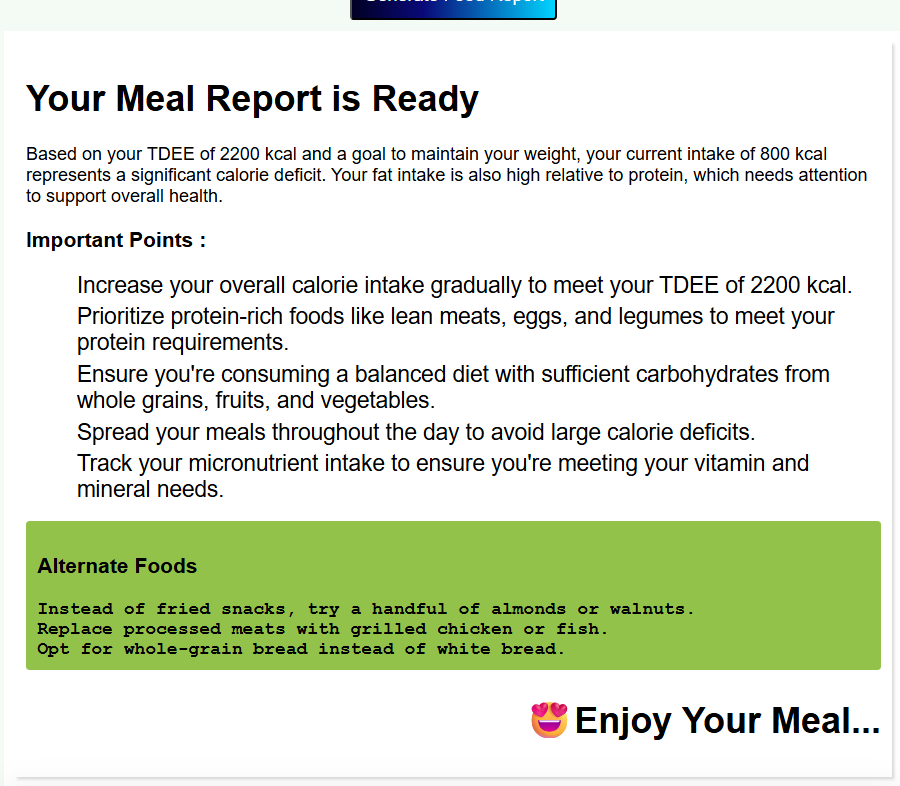
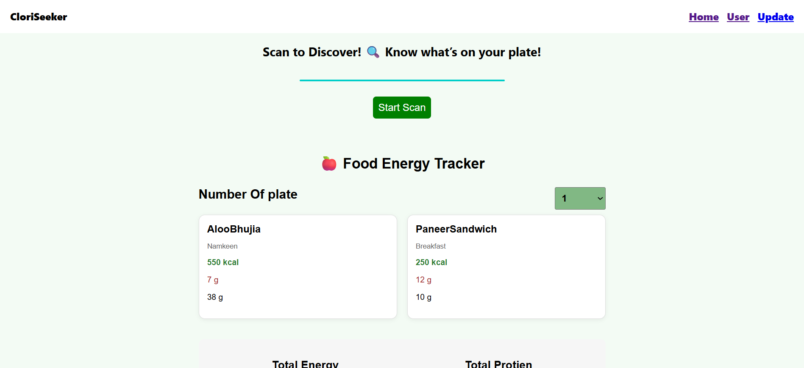
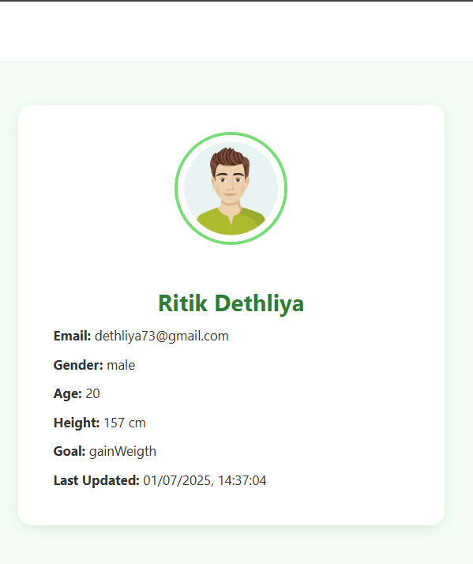

# 🥗 CaloriSeeker
NutriScan is a smart health companion that lets users scan food QR codes to get real-time nutritional information, including calories, protein, fat, and vitamins. The app calculates your ideal intake based on your body metrics and gives a personalized health report

**CaloriSeeker** is a smart dietary recommendation system that allows users to scan food items via QR codes and receive detailed nutritional insights, along with personalized health reports. Built with modern web technologies, this application is tailored for users who want to track their calorie intake and maintain a healthy lifestyle.

---
<p align="center">

  
  &nbsp;&nbsp;
  

  
</p>
## 📸 Demo

👉 **Live Preview**: [https://caloriseeker.netlify.app/](https://caloriseeker.netlify.app/)
<!-- Add a link or GIF/image -->
> 

---

## 🧠 Features

- 🔍 **QR Code Scanner**: Instantly scan food product QR codes.
- 📊 **Detailed Nutritional Breakdown**: View macronutrients and micronutrients like proteins, fats, vitamins, etc.
- 💡 **Personalized Health Reports**: Get feedback based on standard dietary recommendations.
- 🌐 **Multi-platform Support**: Responsive design for mobile and desktop.
- 🗂 **Dynamic Food Database**: Easily updatable JSON-based data for food items.

---

## 🛠️ Tech Stack

### Frontend
- **React** (Vite)
- **React Context API**
- **TailwindCSS** (or custom CSS)
- **React-Icons**
- **QR Scanner Library HTML5QRReader**

### Backend
- **Node.js**
- **Express.js**
- **MongoDB** (with Mongoose)
- **JWT Authentication**

---

## 📁 Project Structure

```bash
CaloriSeeker/
│
├── public/
│   └── assets/         # Static images and icons
│
├── src/
│   ├── components/     # Reusable UI components
│   ├── context/        # Language/Nutrition context
│   ├── data/           # JSON with food nutrition info
│   ├── pages/          # Main views/pages
│   ├── App.jsx         # App root
│   └── main.jsx        # Entry point
│
├── .env                # Environment variables (optional)
├── package.json
└── README.md
